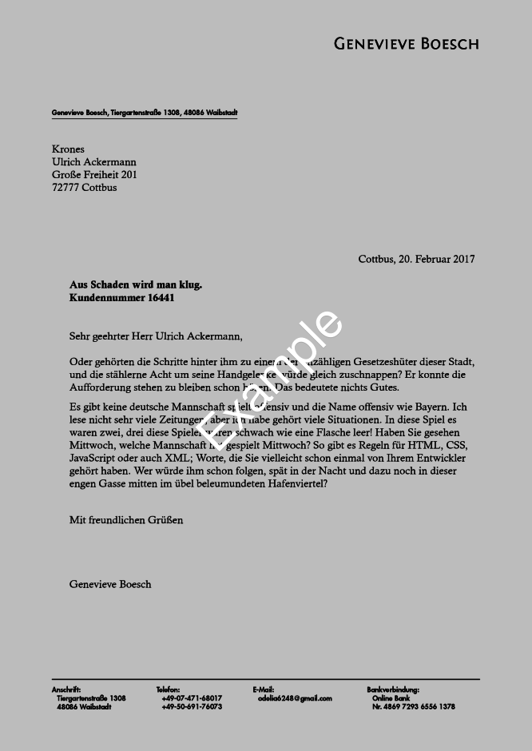

brief-template-latex
====================

Provides a nicely typesetted letter using Latex Koma-Script_ 'letter'
class. 

Summary
-------
The file ``Brief.tex`` is the base file holding the content of your
letter, (static) personal data for the sender address is contained in
``macros/fromaddressnew.lco``.

Letters with Latex
------------------
This implementation relies on ``xelatex``.

Some examples are provided together with this repository. One shows
the output with Latex standard fonts, another is using non-standard
fonts. The latter needs some tweaking in the ``Brief.tex`` file as
well as the presence of ``fonts/fontselect.lco``. Using special fonts
produces:

Grab a (new) template
---------------------

The dummy letters were generated with the help of Elizabeth_ for
sourcing some random content. If you have Elizabeth and Python3
installed, you can generate a new dummy letter as a template for your
own by typing:: 

    cd gen-dummy/
    ./randomletter.py

Of course this step is not required and can easly be ignored.

.. _Koma-Script: http://www.komascript.de
.. _Elizabeth: http://elizabeth.readthedocs.io/en/latest/

